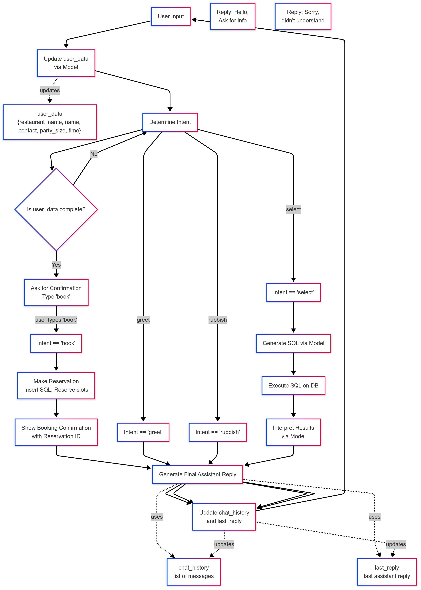

# 🎯 Goal

## ✅ Long Term Goal

Build an intelligent, conversation-first restaurant reservation assistant that streamlines bookings, improves table utilization, reduces no-shows, and delivers a delightful customer experience—scalable across multiple restaurant types and service industries.

## ✅ Success Criteria

* 70%+ booking completion rate
* <2 minutes average time to reserve
* ≥20% drop in no-shows due to intelligent confirmation
* 25% increase in overall reservations
* > 85% table utilization during peak hours
* High customer satisfaction (CSAT > 4.5/5)

---

# 📌 Use Case (100 words)

This assistant helps users make table reservations via natural language conversation, eliminating the need for phone calls or rigid form-filling. A customer simply types or speaks their intent (“Book a table for 4 at Spice Garden at 7 PM”) and the assistant extracts relevant info, checks real-time availability, and books it. The system manages time slots, tables, and customer data intelligently, then confirms the reservation along with an ID to show at the venue. It supports flexible dialogue, partial inputs, and handles follow-ups—all from one interface.

---

## 🔄 Key Steps (Bot Flow - End-User View)

1. User opens chat and types a message like: “Book a table at Olive Bistro for 2 at 8 PM.”
2. Bot asks for missing info (e.g., name, contact).
3. Once all data is collected, bot displays details for confirmation.
4. User types “book” to confirm.
5. Bot checks table availability and slot.
6. If available, books and shares confirmation ID.
7. If not, suggests alternate times or restaurants.
8. Done ✅

---

## 🗂 State Transition Diagram (Mermaid)

---

# 🤖 Bot Features

| Feature                            | Color (Difficulty) | Notes                            |
| ---------------------------------- | ------------------ | -------------------------------- |
| Natural language conversation flow | 🟢 Green           | Easy with LLM                    |
| SQL-based availability checks      | 🟡 Yellow          | Medium—requires schema alignment |
| Dynamic slot + table allocation    | 🟡 Yellow          | Custom logic for seat pooling    |
| Confirmation and ID generation     | 🟢 Green           | Simple insert + return           |
| Conversation memory (chat context) | 🟢 Green           | Stored in session state          |
| Multilingual support (Future)      | 🔴 Red             | Requires translation layer       |
| Integration with POS / CRM         | 🔴 Red             | Future scope                     |

### Tools/Tech:

* **Streamlit**, **SQLite**, **Python**
* **LLaMA3 (LLM)** for intent classification and SQL generation
* Minimal libraries (regex, pandas)

### Knowledge Base (KBs):

* Restaurant details
* Time slots + table mapping
* Reservation rules

### New Feature Requests (Scalable ideas):

* Reminder via WhatsApp/email
* Loyalty/rewards integration
* Feedback collection

---

# 🚀 Scale Up / Rollout Strategy

### Phase 1: Closed Beta

* Launch with 1-2 restaurants
* Real users make test bookings
* Observe user interaction patterns

### Phase 2: Open Pilot

* Add more restaurants of varied sizes
* Monitor table availability logic under load

### Phase 3: Marketplace Integration

* Partner with Swiggy/Zomato-type aggregators
* White-label the assistant

### Testing:

* A/B test with form-based system
* Measure CSAT, conversion rates, no-show rates

---

# 🚧 Key Challenges

1. **Parsing vague user inputs**

   * "Dinner tomorrow with friends" → map to time, party size
2. **Table combination logic**

   * Large party → find multiple tables dynamically
3. **Incomplete info flow handling**

   * Manage mid-conversation drops and recover
4. **Scalability to multiple restaurants**

   * Schema alignment, separate inventories
5. **Fallback handling**

   * What to say when no slots are available

---

